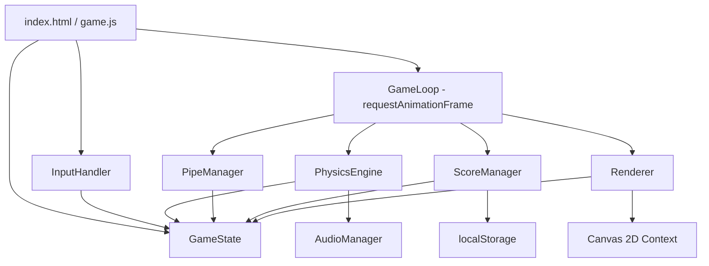
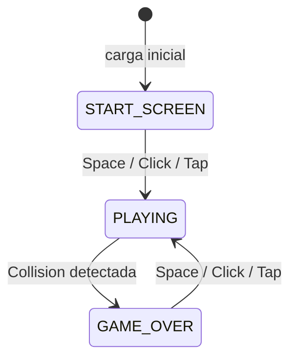
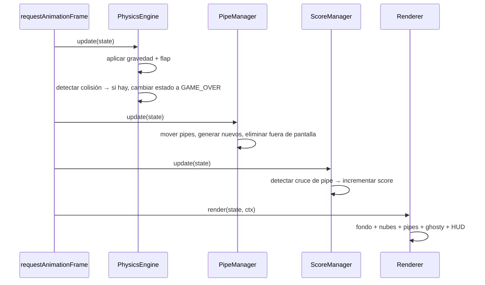

# Design Document: Flappy Kiro

## Overview

Flappy Kiro es un juego de tipo endless scroller que corre íntegramente en el browser usando HTML5 Canvas API, CSS y JavaScript vanilla sin dependencias externas. El jugador controla a Ghosty, un fantasmita que cae por gravedad y sube al recibir input. El objetivo es atravesar pares de tuberías verdes acumulando el mayor puntaje posible.

### Decisiones de diseño clave

- **Sin bundler ni framework**: Todo el código reside en un único archivo `index.html` con un `<script>` inline o en un `game.js` referenciado localmente. Esto garantiza que el juego funcione abriendo el archivo directamente en el browser (protocolo `file://`) o desde cualquier servidor estático.
- **Canvas fijo 480×640**: Las coordenadas internas del juego nunca cambian. El escalado visual se delega a CSS (`max-width`, `aspect-ratio`), lo que simplifica toda la lógica de física y colisiones.
- **Módulos como objetos literales**: Sin ES modules ni clases complejas. Cada subsistema (Physics, Pipes, Renderer, etc.) es un objeto literal con métodos, lo que mantiene el código legible y sin necesidad de transpilación.
- **Game Loop con `requestAnimationFrame`**: Garantiza sincronización con la tasa de refresco del monitor y pausa automática cuando la pestaña pierde el foco.

---

## Architecture

El juego sigue una arquitectura de **Game Loop clásico** con separación de responsabilidades en módulos independientes que se comunican a través de un objeto de estado global (`GameState`).



### Flujo de estados del juego



### Ciclo de un frame (estado PLAYING)



---

## Components and Interfaces

### GameState (objeto global de estado)

Objeto plano que actúa como única fuente de verdad. Todos los módulos lo leen y/o modifican.

```javascript
const GameState = {
  // Estado de la máquina de estados
  phase: 'START',        // 'START' | 'PLAYING' | 'GAME_OVER'

  // Ghosty
  ghosty: {
    x: 100,              // posición X fija durante el juego
    y: 320,              // posición Y actual (píxeles)
    vy: 0,               // velocidad vertical (píxeles/frame)
    width: 40,
    height: 40,
    rotation: 0,         // radianes, calculado por Renderer
  },

  // Pipes
  pipes: [],             // Array de PipeObject (ver Data Models)
  frameCount: 0,         // contador de frames para spawn de pipes

  // Score
  score: 0,
  highScore: 0,

  // Nubes (posiciones inicializadas al cargar)
  clouds: [],            // Array de CloudObject (ver Data Models)

  // Assets cargados
  assets: {
    ghostyImg: null,     // HTMLImageElement
    jumpSound: null,     // HTMLAudioElement
    gameOverSound: null, // HTMLAudioElement
  },
};
```

### InputHandler

Captura eventos del DOM y escribe flags en `GameState` o llama callbacks directamente.

```javascript
const InputHandler = {
  init(canvas, onAction) { /* registra keydown, mousedown, touchstart */ },
  // onAction() se llama cuando el jugador presiona Space/Click/Tap
  // Internamente llama PhysicsEngine.flap() si phase === 'PLAYING'
  // o cambia phase si está en START o GAME_OVER
};
```

### PhysicsEngine

Actualiza la posición y velocidad de Ghosty, detecta colisiones.

```javascript
const PhysicsEngine = {
  GRAVITY: 0.5,          // px/frame²
  FLAP_VELOCITY: -8,     // px/frame (negativo = arriba)
  MAX_FALL_SPEED: 12,    // px/frame
  COLLISION_MARGIN: 4,   // px de tolerancia

  update(state) { /* aplica gravedad, clamp velocidad, actualiza posición */ },
  flap(state) { /* establece vy = FLAP_VELOCITY, reproduce jump.wav */ },
  checkCollision(state) { /* retorna true si hay colisión con pipe o borde */ },
};
```

### PipeManager

Genera, mueve y elimina pares de tuberías.

```javascript
const PipeManager = {
  PIPE_SPEED: 3,         // px/frame hacia la izquierda
  PIPE_WIDTH: 60,        // px
  GAP_HEIGHT: 150,       // px
  SPAWN_INTERVAL: 90,    // frames entre spawns
  MIN_GAP_Y: 60,         // margen superior mínimo del gap
  MAX_GAP_Y: 430,        // margen inferior máximo del gap (640 - 40 HUD - 150 gap - margen)

  update(state) { /* mueve pipes, genera nuevos cada SPAWN_INTERVAL frames, elimina los que salen */ },
  spawnPipe(state) { /* crea un PipeObject con gapY aleatorio dentro de [MIN_GAP_Y, MAX_GAP_Y] */ },
  reset(state) { /* vacía state.pipes y resetea frameCount */ },
};
```

### ScoreManager

Detecta cruces de tuberías, actualiza score y persiste en localStorage.

```javascript
const ScoreManager = {
  STORAGE_KEY: 'flappy-kiro-high-score',

  init(state) { /* lee highScore de localStorage */ },
  update(state) { /* detecta si Ghosty cruzó el centro de algún pipe */ },
  save(state) { /* persiste highScore en localStorage */ },
  reset(state) { /* resetea score a 0 */ },
};
```

### AudioManager

Gestiona la reproducción de efectos de sonido con tolerancia a fallos.

```javascript
const AudioManager = {
  init(state) { /* carga jump.wav y game_over.wav en HTMLAudioElement */ },
  play(audioElement) {
    if (!audioElement) return; // tolerancia a fallo de carga
    audioElement.currentTime = 0;
    audioElement.play().catch(() => {}); // ignora errores de autoplay policy
  },
};
```

### Renderer

Dibuja todos los elementos visuales en el Canvas en el orden correcto.

```javascript
const Renderer = {
  render(state, ctx, canvas) {
    // 1. Fondo azul
    // 2. Textura sketch (líneas semitransparentes)
    // 3. Nubes
    // 4. Pipes
    // 5. Ghosty (con rotación)
    // 6. HUD
    // 7. Overlay según phase (START_SCREEN o GAME_OVER_SCREEN)
  },
  drawBackground(ctx, canvas) { /* #5B8DD9 */ },
  drawSketchTexture(ctx, canvas) { /* líneas blancas opacity 0.05 */ },
  drawClouds(state, ctx) { /* nubes decorativas */ },
  drawPipes(state, ctx) { /* tuberías verdes con borde oscuro */ },
  drawGhosty(state, ctx) { /* sprite rotado */ },
  drawHUD(state, ctx, canvas) { /* barra inferior #1a1a2e con score */ },
  drawStartScreen(state, ctx, canvas) { /* título + instrucciones */ },
  drawGameOverScreen(state, ctx, canvas) { /* overlay semitransparente + resultados */ },
};
```

---

## Data Models

### PipeObject

Representa un par de tuberías (superior + inferior).

```javascript
{
  x: Number,        // posición X del borde izquierdo de las tuberías (inicia en 480)
  gapY: Number,     // posición Y del borde superior del gap
  width: 60,        // ancho fijo en píxeles
  gapHeight: 150,   // alto fijo del gap en píxeles
  scored: false,    // true cuando Ghosty ya cruzó este par (evita doble conteo)
}
```

Geometría derivada:
- **Tubería superior**: `{ x, y: 0, width: 60, height: gapY }`
- **Tubería inferior**: `{ x, y: gapY + gapHeight, width: 60, height: canvas.height - HUD_HEIGHT - (gapY + gapHeight) }`

### CloudObject

Nube decorativa del fondo.

```javascript
{
  x: Number,        // posición X actual
  y: Number,        // posición Y fija
  width: Number,    // ancho (entre 60 y 100 px)
  height: Number,   // alto (entre 30 y 50 px)
  speed: 0.5,       // px/frame hacia la izquierda
}
```

Las nubes se inicializan con posiciones distribuidas a lo largo del Canvas y se reciclan al salir por la izquierda (reaparecen por la derecha).

### Bounding Box de Ghosty (para colisiones)

```javascript
{
  x: state.ghosty.x + COLLISION_MARGIN,
  y: state.ghosty.y + COLLISION_MARGIN,
  width: state.ghosty.width - COLLISION_MARGIN * 2,
  height: state.ghosty.height - COLLISION_MARGIN * 2,
}
```

El margen de 4px en cada lado reduce el bounding box efectivo en 8px por dimensión, dando una tolerancia visual justa.

### Constantes globales del juego

```javascript
const CANVAS_WIDTH  = 480;
const CANVAS_HEIGHT = 640;
const HUD_HEIGHT    = 40;
const PLAY_HEIGHT   = CANVAS_HEIGHT - HUD_HEIGHT; // 600px área de juego
```

---

## Correctness Properties

*A property is a characteristic or behavior that should hold true across all valid executions of a system — essentially, a formal statement about what the system should do. Properties serve as the bridge between human-readable specifications and machine-verifiable correctness guarantees.*

### Property 1: La física aplica gravedad con clamp correcto

*Para cualquier* velocidad vertical inicial `vy` de Ghosty, después de aplicar un frame de física sin flap, la nueva velocidad debe ser `Math.min(vy + 0.5, 12)` — es decir, se incrementa en `GRAVITY` pero nunca supera `MAX_FALL_SPEED`. Esta propiedad consolida la aplicación de gravedad y el límite de velocidad en una sola invariante.

**Validates: Requirements 3.1, 3.3**

### Property 2: El flap establece velocidad ascendente fija

*Para cualquier* estado de Ghosty con velocidad vertical arbitraria, después de ejecutar un flap, la velocidad vertical debe ser exactamente `FLAP_VELOCITY` (−8 px/frame), independientemente del valor previo.

**Validates: Requirements 3.2**

### Property 3: La posición se actualiza correctamente cada frame

*Para cualquier* par `(y, vy)` de posición y velocidad de Ghosty, después de aplicar un frame de física, la nueva posición vertical debe ser `y + vy` (usando la velocidad antes del clamp del frame actual).

**Validates: Requirements 3.5**

### Property 4: Los pipes generados siempre tienen el gap dentro de los límites del Canvas

*Para cualquier* pipe generado por `PipeManager.spawnPipe`, el gap debe estar completamente dentro del área de juego: `gapY >= MIN_GAP_Y` y `gapY + GAP_HEIGHT <= PLAY_HEIGHT` (600px). Esta propiedad garantiza que siempre existe un camino transitable.

**Validates: Requirements 4.3**

### Property 5: Los pipes se mueven exactamente 3 píxeles por frame

*Para cualquier* pipe activo con posición `x`, después de aplicar un frame de `PipeManager.update`, su nueva posición debe ser `x - 3`.

**Validates: Requirements 4.4**

### Property 6: El score incrementa exactamente una vez por pipe cruzado

*Para cualquier* secuencia de N cruces de pares de pipes distintos, el score final debe ser exactamente N. Un pipe marcado como `scored = true` no debe incrementar el score en frames posteriores.

**Validates: Requirements 6.1**

### Property 7: El high score es siempre el máximo histórico

*Para cualquier* secuencia de partidas con scores `s1, s2, ..., sN`, el high score al finalizar debe ser `max(s1, s2, ..., sN)`. El high score nunca puede decrecer entre partidas.

**Validates: Requirements 6.3, 6.4**

### Property 8: Round-trip de persistencia del high score

*Para cualquier* valor entero no negativo de high score, después de guardarlo con `ScoreManager.save()` y recuperarlo con `ScoreManager.init()`, el valor leído debe ser igual al guardado.

**Validates: Requirements 6.4, 6.5**

### Property 9: La colisión con bordes del Canvas es exhaustiva

*Para cualquier* posición de Ghosty con `y < 0` o `y + height > PLAY_HEIGHT` (600px), `PhysicsEngine.checkCollision` debe retornar `true`, independientemente de la posición de los pipes activos.

**Validates: Requirements 5.2**

---

## Error Handling

### Fallos de carga de assets

- **Imágenes**: Si `ghosty.png` no carga, el Renderer dibuja un rectángulo de color como fallback para que el juego sea jugable.
- **Audio**: Si `jump.wav` o `game_over.wav` no cargan, `AudioManager.play()` recibe `null` y retorna sin error. El juego continúa sin sonido (Requirement 1.4).
- **Estrategia**: Todos los assets se cargan con event listeners `onerror` que registran el fallo en consola y continúan la inicialización.

### Política de autoplay del browser

Los browsers modernos bloquean audio sin interacción previa del usuario. `AudioManager.play()` envuelve `audioElement.play()` en un `.catch(() => {})` para silenciar el error de `NotAllowedError` sin romper el flujo del juego.

### localStorage no disponible

Si `localStorage` no está disponible (modo privado en algunos browsers, o contexto sin origen), `ScoreManager.init()` y `ScoreManager.save()` capturan la excepción y operan con `highScore = 0` en memoria.

```javascript
try {
  const stored = localStorage.getItem(STORAGE_KEY);
  state.highScore = stored ? parseInt(stored, 10) : 0;
} catch (e) {
  state.highScore = 0;
}
```

### Pérdida de foco de la pestaña

`requestAnimationFrame` se pausa automáticamente cuando la pestaña pierde el foco, lo que evita que el juego avance en segundo plano. No se requiere manejo adicional.

---

## Testing Strategy

### Enfoque general

El juego usa JavaScript vanilla sin framework de testing preinstalado. Se recomienda **Vitest** (o Jest) para tests unitarios y de propiedades, ya que puede ejecutarse sobre archivos `.js` sin configuración de bundler compleja.

Para property-based testing se usará **fast-check**, una librería madura para JavaScript/TypeScript que genera inputs aleatorios y verifica propiedades universales.

### Tests unitarios (ejemplo-based)

Cubren comportamientos específicos y casos borde:

| Test | Módulo | Criterio |
|------|--------|----------|
| Ghosty inicia en posición central | PhysicsEngine | Req 7.3 |
| Score se resetea a 0 al reiniciar | ScoreManager | Req 7.3 |
| Pipe marcado como `scored=true` no incrementa score de nuevo | ScoreManager | Req 6.1 |
| Pipe fuera del canvas izquierdo es eliminado | PipeManager | Req 4.5 |
| Game Over screen visible tras colisión | GameState | Req 5.3 |
| localStorage indisponible no rompe el juego | ScoreManager | Req 6.4 |

### Tests de propiedades (property-based con fast-check)

Cada test ejecuta mínimo 100 iteraciones con inputs generados aleatoriamente.

**Configuración de fast-check:**
```javascript
import fc from 'fast-check';
// Cada test: fc.assert(fc.property(...), { numRuns: 100 })
```

| Propiedad | Tag | Descripción |
|-----------|-----|-------------|
| Property 1 | `Feature: flappy-kiro, Property 1: gravity applies with clamp` | Genera `vy` aleatorio en `[-20, 20]`, verifica que tras update sea `Math.min(vy + 0.5, 12)` |
| Property 2 | `Feature: flappy-kiro, Property 2: flap sets fixed velocity` | Genera `vy` arbitrario, verifica que tras flap sea exactamente `-8` |
| Property 3 | `Feature: flappy-kiro, Property 3: position updates correctly per frame` | Genera `(y, vy)` aleatorios, aplica un frame, verifica que nueva `y === y + vy` |
| Property 4 | `Feature: flappy-kiro, Property 4: pipe gap always within bounds` | Genera 1000 pipes, verifica que `gapY >= MIN_GAP_Y` y `gapY + 150 <= 600` |
| Property 5 | `Feature: flappy-kiro, Property 5: pipes move 3px per frame` | Genera pipes con `x` aleatorio, aplica un frame, verifica `x_nuevo === x - 3` |
| Property 6 | `Feature: flappy-kiro, Property 6: score increments exactly once per pipe` | Simula N cruces de pipes distintos, verifica score final == N |
| Property 7 | `Feature: flappy-kiro, Property 7: high score is historical maximum` | Genera secuencia de scores aleatorios, verifica que highScore === max de todos |
| Property 8 | `Feature: flappy-kiro, Property 8: high score persistence round-trip` | Genera highScore aleatorio, guarda y lee de localStorage mock, verifica igualdad |
| Property 9 | `Feature: flappy-kiro, Property 9: border collision is exhaustive` | Genera posiciones `y < 0` o `y > 600` aleatorios, verifica que `checkCollision` retorna `true` |

### Estructura de archivos de test sugerida

```
tests/
  unit/
    physics.test.js
    pipeManager.test.js
    scoreManager.test.js
  property/
    physics.property.test.js
    pipeManager.property.test.js
    scoreManager.property.test.js
```

### Cobertura objetivo

- Toda la lógica de `PhysicsEngine`, `PipeManager` y `ScoreManager` debe ser testeable de forma aislada (sin DOM ni Canvas).
- `Renderer` y `AudioManager` se verifican con mocks del Canvas 2D context y HTMLAudioElement.
- Los tests de propiedades cubren los 9 criterios identificados como universalmente cuantificables.
